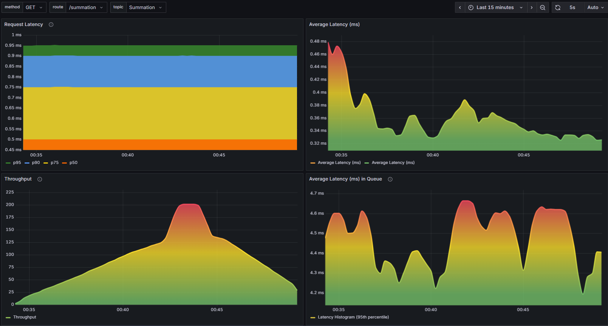

# Distributed System Project

## Overview

This project is a distributed system composed of two main services (Service A and Service B) communicating via Kafka, with monitoring and observability provided by Prometheus and Grafana. The system demonstrates the Outbox Pattern for reliable event publishing, gRPC for inter-service communication, and exposes custom metrics for monitoring.

## Architecture


- **Service A**: Handles gRPC requests, computes summations, stores events in a PostgreSQL DB and dispatches events to Kafka.
- **Service B**: Consumes Kafka messages, aggregates results, exposes REST endpoints, and publishes Prometheus metrics.
- **Kafka**: Message broker for inter-service communication.
- **PostgreSQL**: Stores outbox events for reliable delivery.
- **Redis**: Used by BullMQ for job scheduling in Service A.
- **Prometheus**: Scrapes metrics from Service B.
- **Grafana**: Visualizes metrics from Prometheus.

## Flow

1. **Client** sends a gRPC request to Service A to sum two numbers.
2. **Service A** computes the sum, stores it in the outbox table (PostgreSQL).
3. **BullMQ Job** in Service A periodically dispatches pending events from the outbox to Kafka.
4. **Service B** consumes Kafka messages, aggregates the sum, and persists it.
5. **Service B** exposes REST endpoints for retrieving the sum and metrics.
6. **Prometheus** scrapes metrics from Service B.
7. **Grafana** visualizes metrics for monitoring.

## Components

### Service A 
- **gRPC Server** : Accepts summation requests, stores results in the outbox table.
- **Outbox Pattern** : Ensures reliable event publishing.
- **Kafka Producer** : Publishes events to Kafka.
- **BullMQ Job** : Periodically dispatches pending outbox events.
- **Database** : PostgreSQL configuration.

### Service B 
- **Kafka Consumer** : Consumes summation events, aggregates results.
- **REST API** : Exposes `/summation`, `/metrics` endpoints.
- **Metrics** : Publishes custom metrics for Prometheus.
- **Storage** : Persists aggregated results.

## Monitoring

- **Prometheus** scrapes metrics from Service B at `/metrics`.
- **Grafana** dashboard visualizes:
  - HTTP request latency percentiles
  - Throughput
  - Kafka message latency
  - Aggregated sum



## Features

- **Reliable Event Delivery**: Outbox Pattern ensures events are not lost.
- **Kafka Messaging**: Decoupled, scalable event streaming.
- **Monitoring**: Prometheus metrics and Grafana dashboard for Real-time visualization of system performance.
- **Containerized**: Docker Compose for easy deployment
- **Load Testing**: k6 test scripts included
## How to Run

### Prerequisites
- Docker & Docker Compose
- Node.js (for local development)

### 1. Start Infrastructure

From the project root, run:

```sh
docker-compose up -d
```

This starts PostgreSQL, Redis, Kafka, Zookeeper, Prometheus, and Grafana.

### 2. Configure Environment

Edit `.env` files in [Service A](Service%20A/.env) and [Service B](Service%20B/.env) as needed.

### 3. Start Services

Open two terminals:

**Service A:**
```sh
cd "Service A"
npm install
npm start
```

**Service B:**
```sh
cd "Service B"
npm install
node index.js
```

### 4. Access Grafana

- Grafana: [http://localhost:3030](http://localhost:3030)
- Login: `admin` / `admin`
- Dashboard: Import or use [Grafana/dashboards/custom_metrics_dashboard.json](Grafana/dashboards/custom_metrics_dashboard.json)

## How to Test

### Load Testing

- **Service A gRPC**: Use [Service A](Service%20A/test/k6-gRPC.js) 
with [k6](https://k6.io/):

  ```sh
  docker run --rm -i --network="distributedsystem_devnet" -v "${PWD}:/scripts" grafana/k6 run /scripts/test/k6-gRPC.js
  ```

- **Service B REST**: Use [Service B/test/k6.js](Service%20B/test/k6.js):

  ```sh
  $scriptPath = (Get-Location).Path.Replace('\', '/')
  docker run --rm -i -v "${scriptPath}:/scripts" grafana/k6 run /scripts/k6.js
  ```

### Manual Testing

- **gRPC Client**: Run [Service A/grpc/Client.js](Service%20A/grpc/Client.js):

  ```sh
  node grpc/Client.js 5 7
  ```

- **REST API**: Query Service B:

  ```sh
  curl http://localhost:3000/summation
  curl http://localhost:3000/metrics
  ```

